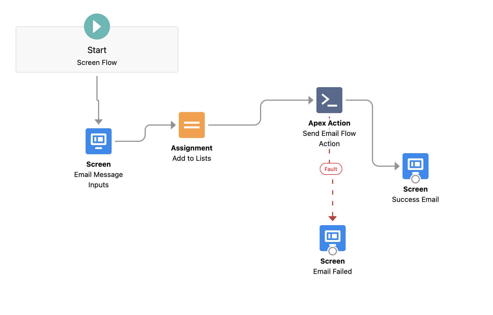

# Send Email Flow Action

The Send Email Flow Action expands on the native Send Email flow action provided by Salesforce to add more functionality that is available like attaching documents. The flow action gives you access to the [Apex SingleEmailMessage](https://developer.salesforce.com/docs/atlas.en-us.apexref.meta/apexref/apex_classes_email_outbound_single.htm) methods
## Installation

Install the latest version of the unmanaged package: [latest release](https://login.salesforce.com/packaging/installPackage.apexp?p0=04t5G000004C4hiQAC)

If you don't want to install the package, feel free to deploy the components themselves by clicking the button below. Take note that this will override any existing components that have the same name.

## Usage

In the flow, make sure to pay attention to the field types for the input fields of the Apex action. For Example, the “To Addresses” input takes a list of input addresses, instead of just one email address.

The flow action references each of the attributes of the Single Email Message Apex class, so for more descriptions on the field names, reference these pages

- [Single Email Message Methods](https://developer.salesforce.com/docs/atlas.en-us.apexref.meta/apexref/apex_classes_email_outbound_single.htm#apex_Messaging_SingleEmailMessage_ctor)
- [Base Email Message Methods](https://developer.salesforce.com/docs/atlas.en-us.apexref.meta/apexref/apex_classes_email_outbound_base.htm#apex_classes_email_outbound_base)

| Field Name | Field Type |
| --- | --- |
| BCC Addresses | String List |
| CC Addresses | String List |
| Character Set | String |
| Entity Attachment IDs | Id List |
| HTML Body | String |
| In Reply To EmailMessage ID | Id |
| Email Opt Out Policy | String |
| Plain Text Body | String |
| Organization-wide Email Address ID | Id |
| References | Id |
| Subject | String |
| Target Object ID | Id |
| Email Template ID | Id |
| To Addresses List | String List |
| Treat Bodies as Template? | Boolean |
| Treat Target Object As Recipient? | Boolean |
| What ID | Id |
| BCC Sender Receives Copy | Boolean |
| Reply To Address | String |
| Save As Activity? | Boolean |
| Sender Display Name | String |
| Use Signature | Boolean |

### Adding the Apex Action to your flow

- The Apex Action is called, "Send Email Flow Action"

Example Flow setup

## Troubleshooting

- Make sure you're adding the values for the "String List" fields above to Collection variables in your flow
    - See the example above, where there's an "Assignment" step to adding those values to a list

    

- Some of the Email options require other fields to be conditionally required based on usage and whether you're using Email Templates, Email Templates with merge fields, Saving as an Activity, etc. Setup a fault action to properly debug your use-case before deploying to a Production Environment.